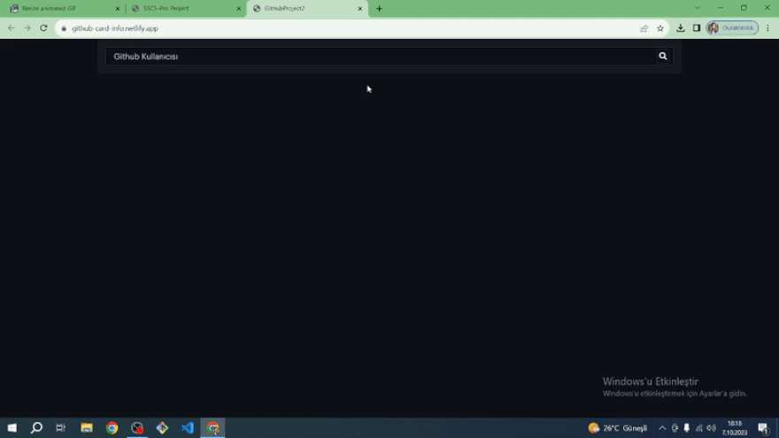

# AxiosJsGithubProject

<!DOCTYPE html>
<html lang="en">
<head>
    <meta charset="UTF-8">
</head>
<body>
    
  
It is a project consisting of cards containing information about users' Github profiles. In this project, axios was used to pull information from Github.

<h2 id="built-with">Built With</h2>
  <ul>
    <li>HTML</li>
    <li>CSS</li>
    <li>JAVASCRIPT</li>
  </ul>

You can reach to Website, when you are click <a href="https://github-card-info.netlify.app/">HERE</a>.

You can search a anybody's github username at page's input. System will give the card about that person's github account.

</body>
</html>

Screenshot 
